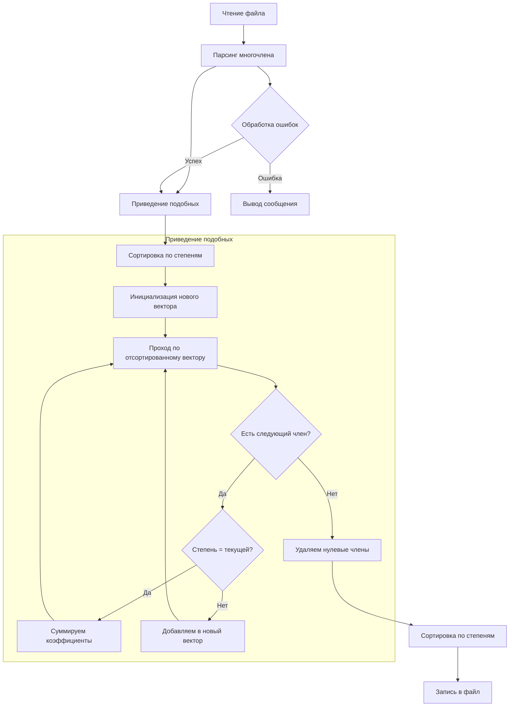

# Обработка многочленов
## Защита проекта

---

## Постановка задачи

- Разработка программы для обработки многочленов от одной переменной
- Чтение многочлена из файла
- Приведение подобных членов
- Сортировка по убыванию степеней
- Сохранение результата

---

## Введение в алгоритм

В реализации алгоритма обработки многочленов мы использовали объектно-ориентированное программирование (ООП), что позволило нам создать модульную и легко расширяемую структуру программы. Основной класс `Polynomial` инкапсулирует всю логику работы с многочленами, включая их хранение, обработку и вывод.

Для хранения членов многочлена мы используем вектор структур, где каждый элемент содержит коэффициент и степень. Это позволяет эффективно выполнять операции над многочленом и легко добавлять новые члены. 

Процесс приведения подобных членов выполняется в несколько этапов:
1. Сначала выполняется сортировка членов по степеням для группировки подобных
2. Затем происходит последовательный проход по отсортированному вектору
3. При обнаружении членов с одинаковыми степенями их коэффициенты суммируются
4. Члены с нулевыми коэффициентами удаляются из многочлена
5. Результат сохраняется в новом векторе

Обработка ошибок реализована с использованием механизма исключений (exceptions), что делает код более надежным и позволяет корректно обрабатывать различные ошибочные ситуации, такие как некорректный формат входных данных или переполнение при вычислениях.

Для работы с файлами мы использовали стандартные потоки ввода-вывода C++, что обеспечивает кроссплатформенность и простоту использования. Парсинг входной строки реализован с помощью регулярных выражений, что позволяет гибко обрабатывать различные форматы записи многочленов.

---

## Алгоритм решения



---

## Структура программы

- Основные компоненты:
  - Чтение/запись файлов
  - Парсинг многочлена
  - Обработка ошибок
  - Математические операции

---

## Примеры работы

### Входные данные:
```
5y^3 + 2y - 7 + 3y^2
```

### Результат:
```
5y^3 + 3y^2 + 2y - 7
```

---

## Обработка ошибок

- Пустой файл
- Некорректные символы
- Неверный формат степени
- Переполнение коэффициентов

---

## Тестирование

### Тест 1: Приведение подобных
```
Вход: 5y^2 - 5y^2 + 10
Выход: 10
```

### Тест 2: Сортировка
```
Вход: 2y - 7 + 5y^3 + 3y^2
Выход: 5y^3 + 3y^2 + 2y - 7
```

---

## Заключение

- Реализованы все требования
- Корректная обработка ошибок
- Удобный формат ввода/вывода
- Возможность дальнейшего расширения

---

## Спасибо за внимание! 
